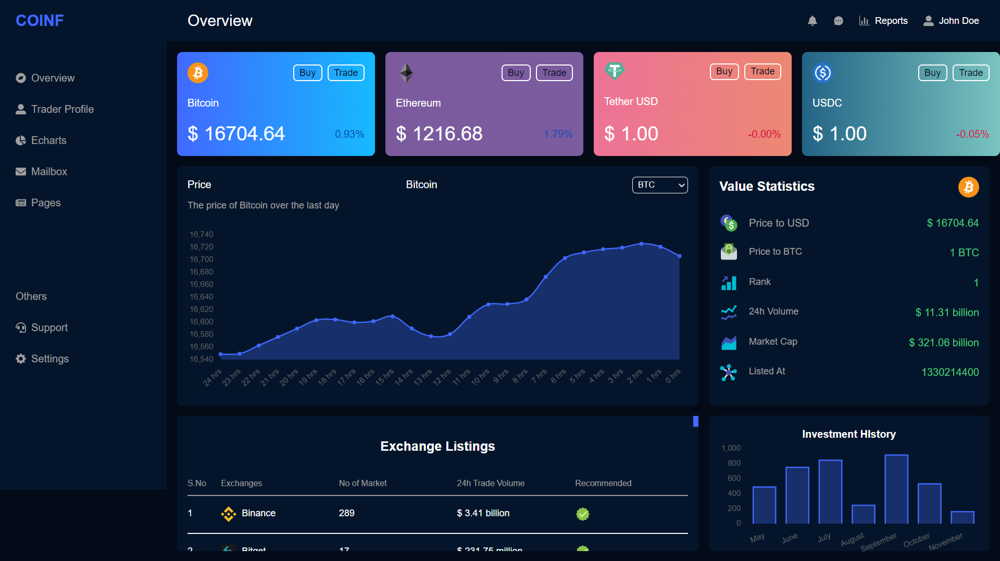
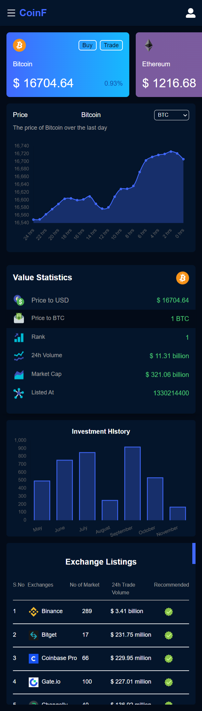

# Crypto Dashboard
> A fully responsive crypto dashboard tracks realtime status of cyrptos, build using ReactJS and ChartJS.

## Content
- [Techstack](#techstack)
- [Screenshot](#screenshot)
- [Links](#links)
- [Author](#author)  

## Techstack 
- ReactJs
- Tailwind CSS
- API  
## Screenshot  

  

  

  

## Links  
- Live Site - [Demo](https://unrivaled-cuchufli-9ec2b2.netlify.app/)  

## Author
GitHub - [@Sourabh358](https://github.com/SOURABH358)  
Frontend Mentor - [@Sourabh358](https://www.frontendmentor.io/profile/sourabh358)  
❤ **Sourabh Yadav**
